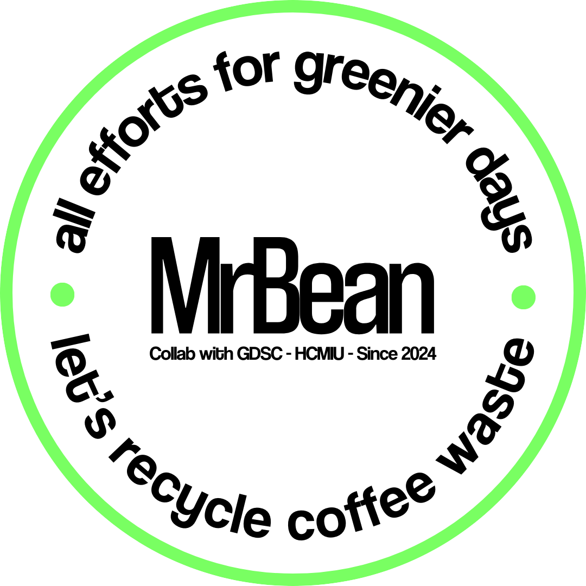

<h1 align="center">MrBean Mobile App - IU Startup Demo Day 2024 </h1>

  

## Contents

- [Brief description](#brief-description)
- [Language and Tools](#language-and-tools)
- [Project details](#project-details)
- [App photos](#app-photos)

## Brief description

- This is a mobile app project called "MrBean" that we built for IU Startup Demo Day 2024. MrBean is a "green" application that creates a bridge for exchanging coffee grounds between individuals and businesses. This application aims to encourage the reuse and recycling of coffee grounds, while contributing to reducing waste and negative impacts on the environment.
- Project link (GitHub): [MrBeanMobileApp](https://github.com/phamgiaphuc/MrBeanMobileApp)
- Project's author:
  - Pham Gia Phuc - Leader
  - Do Pham Tuan Hung - Member
  - Vu Hong Quang - Member
  - Le Thanh Danh - Member
  - Nguyen Thanh Hung - Member

## Language and Tools

## Project details

- [Link](https://drive.google.com/file/d/1pydX9a5Je3cw0VLgvkw5Xsoj8bnUZgGf/view?usp=sharing)

## App photos

- [Link](https://drive.google.com/drive/folders/1Hhlut20ZOhg7x_1TU8Shj3OuwHSa3MHr?usp=sharing)
